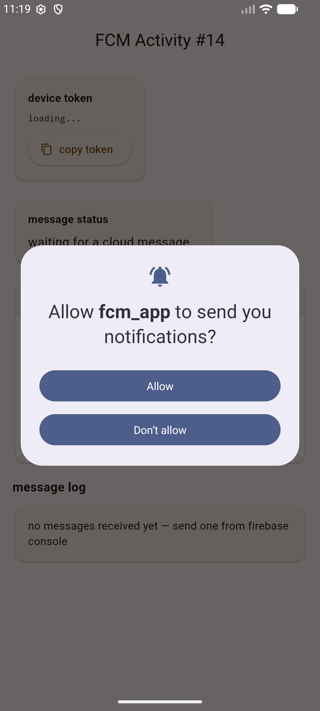
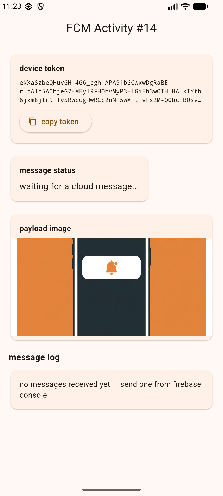
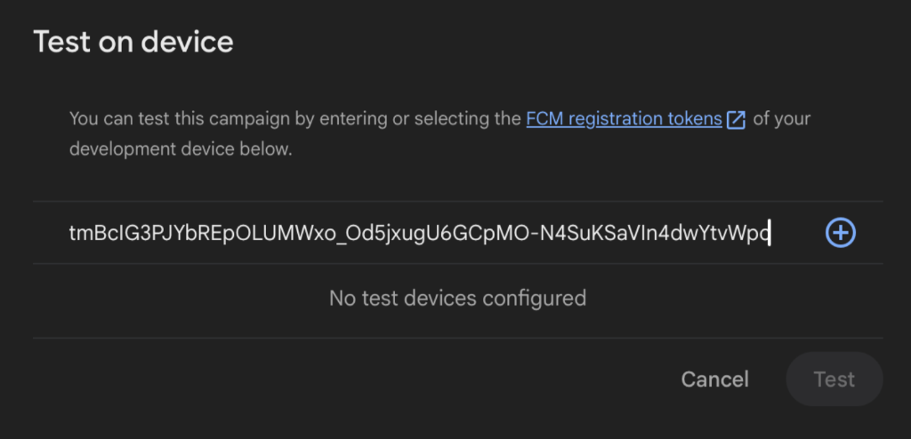
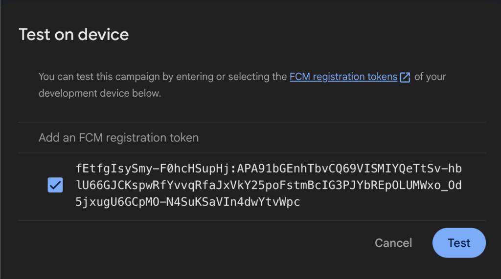
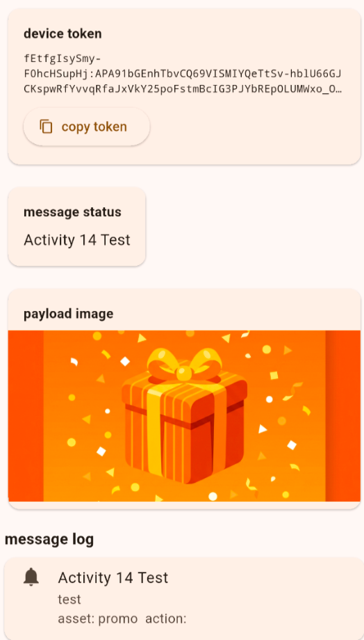
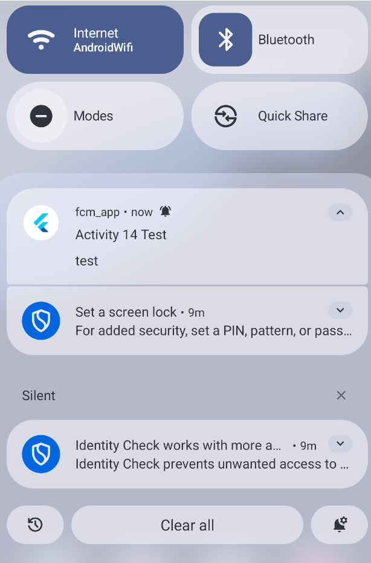

# Activity 14 — Testing Evidence

Here are the screenshots documenting the testing flow for Firebase Cloud Messaging in the `fcm_app` application.

## 1. Initial Permission Request
On first launch, the app successfully requests Android 13+ POST_NOTIFICATIONS permission from the user.

## 2. Token Generation
Once allowed, the app successfully connects to Firebase and retrieves the unique device token.

## 3. Firebase Console Configuration
This shows how the notification was composed in the Firebase Console (using the "Send test message" bypass to instantly deliver the message to the device for testing).

## 4. Foreground Message & Payload Update
When the app is in the foreground, `FirebaseMessaging.onMessage` fires. The custom payload data (`asset: promo`) is read successfully, triggering a UI update that swaps the default image to the gift box and adds the event to the message log.

## 5. Background Notification
When the app is placed in the background, FCM automatically handles the message and places a system notification in the Android tray.

